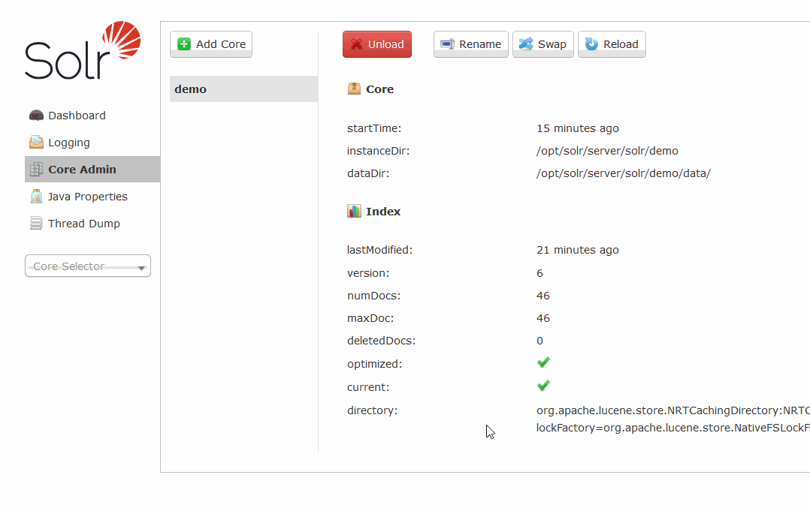

# 10.31日爆出的RCE

## 简介

该漏洞是由于Velocity模板存在注入所致（Velocity是一个基于Java的模板引擎，可让使用者通过模板语言引用Java中定义的对象）攻击者在知道Solr服务器上Core名称后，先把`params.resource.loader.enabled`设置为true（就可加载指定资源），再进行远程执行命令。

## 启动环境

```bash
cd Velocity_RCE
docker-compose up -d
```

solr下载比较慢得多等会

## 复现过程



1. 确定`core admin`下存在一个可用的core
2. 修改`/solr/demo/config`路径中间的core名为你找到的core
3. 执行命令时`/solr/demo/selec`路径中间的core名也要记得改

## 参考链接

1. https://mp.weixin.qq.com/s/_mwnPuvqBP945D3g-j8Hrw
2. https://gist.githubusercontent.com/s00py/a1ba36a3689fa13759ff910e179fc133/raw/fae5e663ffac0e3996fd9dbb89438310719d347a/gistfile1.txt
3. https://nosec.org/home/detail/3113.html

